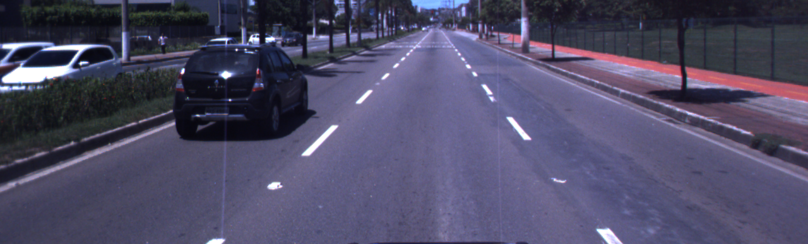
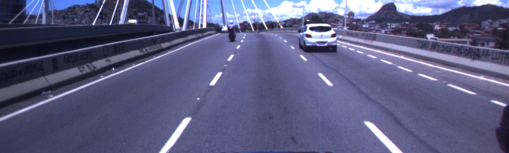
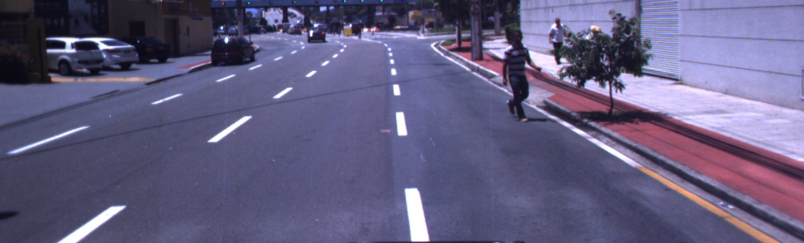

# Aplicando KittiSeg da MultiNet com dados da IARA


 - **Disciplina**: Deep Learning 2017/2
 - **Alunos**: Lucas Coutinho and Vinicius Cardoso
 - **Professor**: Alberto Ferreira de Souza

### Introdução

Neste trabalho foi utilizada a ferramenta de segmentação de pista [KittiSeg](https://github.com/MarvinTeichmann/KittiSeg) desenvolvido como parte da [MultiNet](https://github.com/MarvinTeichmann/MultiNet).
O modulo KittiSeg foi desenvolvido por Xing e apresentado no artigo [MultiNet: Real-time Joint Semantic Reasoning for Autonomous Driving](https://arxiv.org/abs/1612.07695) para tarefa de Segmentção de pista e faixas,
alcançando a 1ª colocação na [Kitti Dataset](http://www.cvlibs.net/datasets/kitti/eval_road_detail.php?result=ca96b8137feb7a636f3d774c408b1243d8a6e0df) quando submetido, atualmente ocupa a 26ª posição.

Esta ferramenta foi então testada e avaliada nos dados da IARA, o [Relatorio](link) descreve essa avalição e resultados obitidos.

### Dependencias
    
    [Tensorflow 1.0]()
    python 2.7
    python libraries:
       * matplotlib
       * numpy
       * Pillow
       * scipy
       * commentjson
    Essas bibliotecas podem ser instaladas via: `pip install numpy scipy pillow matplotlib commentjson`
     ou `pip install -r requirements.txt`. (arquivo dentro do diretorio KittiSeg)

### Configuracao
    
Após instalar as dependencias:

   1. Clone esse repositório: 
        `git clone https://github.com/vinibc/KittiSeg.git`
   2. Inicialize todos os submodulos:
        `git submodule update --init --recursive`
   3. [Optional] Download Datasets:
        1. Kitti Road Data:
            * Retrieve kitti data url here: http://www.cvlibs.net/download.php?file=data_road.zip
            * Call python download_data.py --kitti_url URL_YOU_RETRIEVED
        2. Imagens IARA (não anotadas)
            * link dropbox


### Rodando a ferramenta


```bash

```


### Resultados

A pasta `examples` contem algumas amostras dos dados da IARA. 
As imagens foram gravadas das cameras stereo ZED posicionada no parabrisas da IARA e uma Bumblebee posicionada no teto da IARA
* Bumblebee Fernando Ferrari dataset
  

   

Results from the complete recording which the samples were extracted are presented in [this]() video.
