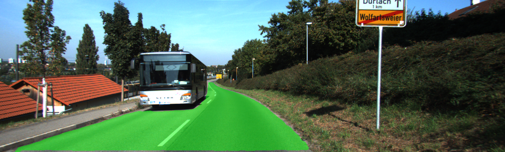

# Aplicando KittiSeg da MultiNet com dados da IARA


 - **Disciplina**: Deep Learning 2017/2
 - **Alunos**: Lucas Coutinho and Vinicius Cardoso
 - **Professor**: Alberto Ferreira de Souza

### Introdução

Neste trabalho foi utilizado a rede neural para segmentação de pista [KittiSeg](https://github.com/MarvinTeichmann/KittiSeg) 
desenvolvida como parte da [MultiNet](https://github.com/MarvinTeichmann/MultiNet).
No artigo da [MultiNet: Real-time Joint Semantic Reasoning for Autonomous Driving](https://arxiv.org/abs/1612.07695),
 Teichmann et al. propoem uma arquitetura de rede que pode executar classificação, detecção e segmentação semântica de forma eficiente e simultânea (menos de 100 ms para realizar uma inferência).
A eficácia da rede foi verificada no [Kitti Vision Benchmark](http://www.cvlibs.net/datasets/kitti/eval_road_detail.php?result=ca96b8137feb7a636f3d774c408b1243d8a6e0df) 
e provou que seu desempenho na segmentação de pista era o estado da arte 

Para a realização dos experimentos utilizamos imagens extraídas de logs gerados pela IARA (Intelligent Autonomous Robotic Automobile),
 o carro autônomo desenvolvido pelo Laboratório de Computação de Alto Desempenho (LCAD) da UFES.
O [Relatorio](link) descreve essa avalição e resultados obitidos.

### Dependencias
    
    [Tensorflow 1.0](https://www.tensorflow.org/install/)
        (Neste trabalho foi utilizado o modo de instalacao com suporte a CUDA e Virtualenv)
    python 2.7
    python libraries:
       * matplotlib
       * numpy
       * Pillow
       * scipy
       * commentjson
    Essas bibliotecas podem ser instaladas via: `pip install numpy scipy pillow matplotlib commentjson`
     ou `pip install -r requirements.txt`. (arquivo dentro do diretorio KittiSeg)

### Configuracao
    
Após instalar as dependencias:

   1. Clone esse repositório (foi feito um fork do [repositorio original](https://github.com/MarvinTeichmann/KittiSeg)): 
        `git clone https://github.com/vinibc/KittiSeg.git`
   2. Inicialize todos os submodulos:
        `git submodule update --init --recursive`
   3. [Optional] Download Datasets:
        1. Kitti Road Data:
            * Retrieve kitti data url here: http://www.cvlibs.net/download.php?file=data_road.zip
            * Call python download_data.py --kitti_url URL_YOU_RETRIEVED
        2. Imagens IARA (não anotadas)
            * link dropbox


### Rodando a ferramenta

1. Preparando dados:
        1. Faça uma lista com o caminho das imagens que deseja passar para a rede no seguinte padrao:
            caminho/nomeimage.png
            `ls caminho/*.png > list_images.txt`
2. Mova o script demo_kittiseg_iara.py para a pasta KittiSeg onde foi clonado

3. Execute o script para realizar a inferencia na lista de imagens:

```bash
    python demo_modified.py --input_image /caminho/list_images.txt --output_image pasta_de_saida/ --gpus 0
```
o comando -- gpu para escolher qual GPU sera utilizada
o nome das imagens serao os mesmos das originais concatenados com _green.png (imagem com overlayer dado treshold) e _raw.png (imagem de todas as inferencias inclusive abaixo do treshold)
A rede usa 11.74GB da GPU, porem uma vez que o modelo subiu para placa, a inferencia e rapida (cerca de 0.140s)


### Resultados

As imagens foram gravadas das cameras stereo ZED posicionada no parabrisas da IARA e da camera stereo Bumblebee posicionada no teto da IARA.
Apenas a imagem mais central foi usada i.e. imagem da camera esquerda da ZED e imagem da camera direita da Bumblebee.
A pasta `examples` contem algumas amostras dos dados da IARA.

Tres datasets foram utilizados para avaliar o desempenho da KittiSeg nos dados da IARA:
    1. ZED Fernando Ferrari com X imagens e resolucao WxH mantendo o ratio dos dados da KITTI
    2. Bumblebee Fernando Ferrari
    3. Bumblebee Volta da UFES
As imagens foram cortadas para retirar a frente do carro e mantido o ratio dos dados da KITTI para um padrao para avaliacao.
Para cada dataset, foram executados 4 experimentos variando o treshold de confianca da rede neural, 0.5, 0.1, 0.01, 0.001.
Os melhores resultados obitidos foram usando o treshold 0.001.

* ZED Fernando Ferrari dataset (treshold de deteccao 0.001)

   

* Bumblebee Fernando Ferrari dataset (treshold de deteccao 0.001)

   

* Bumblebee Volta da UFES dataset (treshold de deteccao 0.001)

   

* KITTI Dataset

   

O video completo dos resultados obtidos podem ser visualizados nestes videos:
 [ZED Fernando Ferrari]()
 [Bumblebee Fernando Ferrari]()
 [Bumbleblee Volta da UFES]()
 [Comparacao melhores ZEDxBumblebee Fernando Ferrari]()

Descricao detalhada dos experimentos pode ser vista no [Relatorio](link).


Referencia:
```
Teichmann, Marvin, Michael Weber, Marius Zoellner, Roberto Cipolla, and Raquel Urtasun,
 "Multinet: Real-time joint semantic reasoning for autonomous driving," arXiv preprint arXiv:1612.07695, 2016.
```
