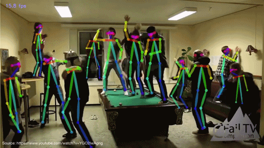

# UFES - Deep Learning 2017-2

**Integrantes**: Emilia Cremasco e Daniel Cardoso

**Professor**: Alberto Ferreira De Souza

## Índice

- [Openpose](#openpose)
- [Pré Requisitos](#pre-requisitos)
  - [Sistemas operacionais homologados](#Sistemas operacionais homologados)
- [Instalação do OpenPose manualmente](#instalacao-do-openpose-manualmente)
  - [Selecionar o Makefile (execute apenas um dos próximos 4 comandos)](#selecionar-o-makefile-execute-apenas-um-dos-proximos-4-comandos)
  - [Compilar o Caffe](#compilar-o-caffe)
          - [Instalar o OpenPose](#Instalar-o-openpose)
  - [O arquivo deve ser a mesma versão do CUDA e sistema operacional](#o-arquivo-deve-ser-a-mesma-versao-do-cuda-e-sistema-operacional)
  - [Modificar qualquer flag personalizado de Makefile.config resultante (e.g. OpenCV 3, Atlas/OpenBLAS/MKL, etc.)](#modificar-qualquer-flag-personalizado-de-makefileconfig-resultante-eg-opencv-3-atlasopenblasmkl-etc)
  - [Instalação e execução do código](#instalacao-e-execucao-do-codigo)
- [Experimento](#experimento)
- [Resultado](#resultado)

# Openpose
OpenPose é uma biblioteca de detecção de articulações multi-pessoa, ou seja,é capaz de identificar as articulações de varias pessoas numa mesma imagem ao mesmo tempo. A detecção ocorre em tempo real e é possível detectar corpo, rosto e mãos.
A documentação detalhada pode ser encontrada no respositório oficial [aqui](https://github.com/CMU-Perceptual-Computing-Lab/openpose). Existe um vídeo do próprio autor no [YouTube](https://www.youtube.com/watch?v=OgQLDEAjAZ8&t=5s) explicando o funcionamento da Openpose. O paper pode ser obtido através deste [link](https://arxiv.org/pdf/1611.08050.pdf).
<p align="center">
    
</p>

# Pré Requisitos

### Sistemas operacionais homologados
- Ubuntu 14 and 16.
- Windows 8 and 10.
- Nvidia Jetson TX2
- Windows 7, Mac, CentOS, and Nvidia Jetson (TK1 and TX1), funciona mas não é suportada pelos desenvolvedores.

### Configuração mínima recomendada de hardware

- Placa gráfica NVIDIA com pelo menos 1.6 GB disponível
- No mínimo 2GB de memória RAM disponível
- Altamente recomendada a utilização da biblioteca cuDNN da NVIDIA e CPU com pelo menos 8 núcleos


### Obtendo repositório
```sh
git clone https://github.com/CMU-Perceptual-Computing-Lab/openpose
```

# Procedimento de instalação
O procedimento de instalação descrito tomará como base o sistema operacional Ubuntu 14, versão utilizada durantes os experimentos no LCAD.

### Instalação via script
```sh
cd openpose #entre no diretorio raiz do repositorio
bash ./ubuntu/install_caffe_and_openpose_if_cuda8.sh #execute o script de instalacao
```
Alternativamente, pode ser feita a instalação manual, na qual o usuário pode alterar alguns parâmetros conforme necessidade. Maiores detalhes desta abordagem podem ser encontrados no [guia de instalação da Openpose](https://github.com/CMU-Perceptual-Computing-Lab/openpose/blob/master/doc/installation.md).

Para verificar se instalação ocorreu corretamente, execute o comando abaixo para rodar um exemplo disponibilizado pelo time do Openpose:

```sh
./build/examples/openpose/openpose.bin --video examples/media/video.avi
```

# Execução do experimento
Durante os experimentos, foram desenvolvidos dois programas visando:
 - Anotação de bounding box
 - Marcação da detecção de pessoas
 
Para executa-los, siga os passos a seguir:

- Clone o repositório
```sh
git clone https://github.com/LCAD-UFES/Deep-Learning-2017-2
```
- Navegue até o diretório do projeto
```sh
cd Deep-Learning-2017-2/emilia-daniel
```
- Copie os arquivos `openpose-iara.cpp` e `video-annotation.cpp` para o diretório raiz do repositório do Openpose (que você baixo anteriormente)
```sh
cp video-annotation.cpp <PATH_REPOSITORIO_OPENPOSE>
cp openpose-iara.cpp <PATH_REPOSITORIO_OPENPOSE>/examples/user_code #espaço recomendado para codigos dos usuarios
```
- Compilação
  - Anotação de bounding box:
  ```sh
  g++ -o video-annotation video-annotation.cpp -W -Wall `pkg-config --cflags opencv` -O4 `pkg-config --libs opencv`
  ```
  - Detecção de pessoas:
  ```sh
  make
  ```
- Execução  
  - Anotação de bounding box (o arquivo groundtruth.txt será criado no diretório raiz):
  ```sh
  ./video-anotation <VIDEO_PATH> #replace <VIDEO_PATH> for the video path
  ```
  - Detecção de pessoas (o arquivo groundtruth.txt deve estar no diretório raiz)::
  ```sh
  build/examples/user_code/openpose-iara.bin <VIDEO_PATH> #replace <VIDEO_PATH> for the video path
  ```
Caso execute diretamente na máquina **car02** do LCAD, já existe um exemplo de arquivo de log do iara (output.mp4) no diretório raiz do nosso projeto `/media/raid0/Datasets/Emilia-daniel/openpose/` e as marcações dos ground truth feitas pela ferramenta **video-annotation** são encontradas no arquivo `groundtruth.txt`. Para o experimento, foram feitas 516 marcações de pessoas.
