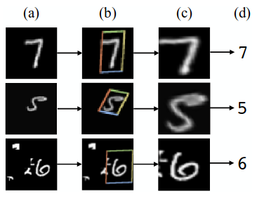
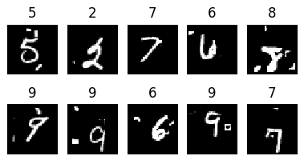
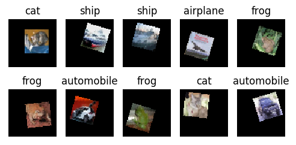

Spatial Transformer Networks
============================

**Estudantes:** Lucas Caetano Possatti e Rafael Horimoto de Freitas

**Professor:** Alberto Ferreira De Souza

**Disciplina:** Deep Learning 2017-2

<!-- TODO: Tentar colocar um índice aqui depois. -->

## Introdução

Neste trabalho, nós fizemos alguns testes com *Spatial Transformer Networks* em versões deformadas do MNIST e CIFAR-10, utilizando o framework [Keras][keras]. O código para os experimentos, bem como o relatório, podem ser encontrados em [github.com/possatti/mestrado-dl-stn][mestrado-dl-stn]. Este documento foca na execução dos experimentos. Para mais informação sobre STNs, nossa metodologia e resultados, por favor leia o [relatório][relatorio] e também o [paper da STN][stn-paper].

<!-- TODO: Colocar link para o relatório. -->

[keras]: https://keras.io/
[stn-paper]: https://arxiv.org/abs/1506.02025
[mestrado-dl-stn]: https://github.com/possatti/mestrado-dl-stn
[relatorio]: https://github.com/possatti/mestrado-dl-stn/blob/master/relatorio/main.pdf

## Spatial Transformer Networks

*Spatial Transformer Networks* são redes neurais que incluem uma ou mais camadas de *Spatial Transformers*. O *Spatial Transformer* é um módulo que aplica uma transformação espacial no *feature map* de entrada (e.g. uma transformação afim). Ele é composto por três partes: rede de localização, *grid generator*, e *sampler*. Nós utilizamos uma implementação que nos permite se preocupar apenas com a rede de localização.



## Experimentos

Neste trabalho nós fizemos alguns experimentos envolvendo versões distorcidas do MNIST e do CIFAR-10. A versão distorcida do MNIST, que chamamos de *cluttered MNIST*, pode ser encontrada [neste link][cluttered-mnist]. E criamos imagens distorcidas do [CIFAR-10][CIFAR-10] através de scripts próprios, e o chamamos de CIFAR-10-DISTORTED.

Nós treinamos dois tipos de modelo em cada um desses datasets: *Baseline* e STN. O modelo *baseline* é um *Convolutional Neural Network* (CNN) composto por camadas dos seguintes tipos: convolucionais; *MaxPooling*; e *Fully Connected Layers* ao final da rede. A composição exata é diferente para cada dataset. Já a STN é uma rede que difere da *baseline* apenas no fato de que ela contém um *Spatial Transformer* como primeira camada.

[cluttered-mnist]: https://github.com/daviddao/spatial-transformer-tensorflow/raw/master/data/mnist_sequence1_sample_5distortions5x5.npz

[CIFAR-10]: https://www.cs.toronto.edu/~kriz/cifar.html

O *cluttered MNIST* foi construído ao aplicar translações e adicionar artefatos (*clutter*) aleatoriamente nas imagens originais do MNIST. Veja alguns exemplos de imagens do *Cluttered MNIST*:



E criamos o CIFAR-10-DISTORTED através do seguinte processo para cada imagem: expandimos o canvas original de 32x32 para 64x64, mantendo a imagem original centralizada no canvas (ainda em 32x32) e preenchendo com preto ao redor; aplicamos uma rotação aleatória no range de [-20, +20] graus; aplicamos translações verticais e horizontais aleatórias no range de [-10, +10] píxeis; e, adicionalmente, espelhamos horizontalmente (apenas com dados de treino). Veja exemplos de imagens do CIFAR-10-DISTORTED:



### Requisitos

Para os experimentos, criamos um conjunto de scripts em Python 3 usando as seguintes bibliotecas:
 - Tensorflow
 - Keras
 - Scipy
 - Numpy
 - Matplotlib
 - Scikit Learn
 - Pillow
 - Pandas

Sugerimos que você leia as instruções de instalação do Tensorflow no [site oficial][install-tensorflow], uma vez que você pode se beneficiar de características específicas do seu computador.

Para as outras dependências, incluímos um `requirements.txt` em nosso repositório. Para usá-lo, execute `pip install -r src/requirements.txt` na raíz do repositório. Recomendamos a utilização de um [ambiente virtual][virtualenv-tutorial] para isolar essas bibliotecas do restante do sistema.

[virtualenv-tutorial]: http://docs.python-guide.org/en/latest/dev/virtualenvs/
[install-tensorflow]: https://www.tensorflow.org/install/install_linux

Executamos nossos experimentos em um computador com Ubuntu 14.04.4 LTS e três placas de vídeo GeForce GTX 660. Sugerimos que você utilize algo similar.

### Execução no cluttered MNIST

Baixe o cluttered MNIST da seguinte forma:

```sh
cd data/
sh download_cluttered_mnist.sh
```

Para treinar e avaliar os modelos, use:

```sh
python src/cluttered_mnist/run.py evaluate
```

Para visualizar algumas imagens sendo transformadas pelo Spatial Transformer no último modelo treinado, use:

```sh
python src/cluttered_mnist/run.py --load-last visualize
```

Você pode especificar quantas épocas usar para o treino com a opção `--epochs`. Por exemplo:

```sh
python src/cluttered_mnist/run.py --epochs 20 evaluate
```

### Execução no CIFAR-10-DISTORTED

Para baixar o CIFAR-10 e gerar o CIFAR-10-DISTORTED execute:

```sh
python data/create_cifar10_distorted.py build
```

Para treinar, avaliar, e visualizar as transformações da STN no CIFAR-10-DISTORTED,  utilize o script `src/cifar10/run.py`. As principais operações são:

```sh
# Treinar o baseline e stn com 10 épocas.
python src/cifar10/run.py train

# Avaliar os últimos modelos treinados no conjunto de teste.
python src/cifar10/run.py evaluate

# Visualizar algumas imagens passando pela ST (usa o último modelo treinado).
python src/cifar10/run.py visualize
```

Também é possível controlar melhor alguns parâmetros de execução usando as seguintes opções:

```sh
# Especificar número de épocas e batch size.
python src/cifar10/run.py train --epochs 20 --batch-size 200

# Usar apenas o baseline ou o stn.
python src/cifar10/run.py --only baseline train
python src/cifar10/run.py --only stn evaluate

# Visualizar algumas imagens passando pelo Spatial Transformer.
python src/cifar10/run.py visualize

# Especificar qual dataset usar: original ou distorcido.
python src/cifar10/run.py --dataset CIFAR-10 train
python src/cifar10/run.py --dataset CIFAR-10-DISTORTED train
```

É possível visualizar o treino no Tensorboard, usando:

```sh
tensorboard --logdir src/cifar10/tblogs
```

Serão criados "checkpoints" de cada época em `src/cifar10/checkpoints/`. E ao final do treino, os modelos serão salvos em `src/cifar10/trained/`.

## Resultados

Os resultados se encontram no relatório, juntamente com mais informação sobre STNs e os testes realizados.
